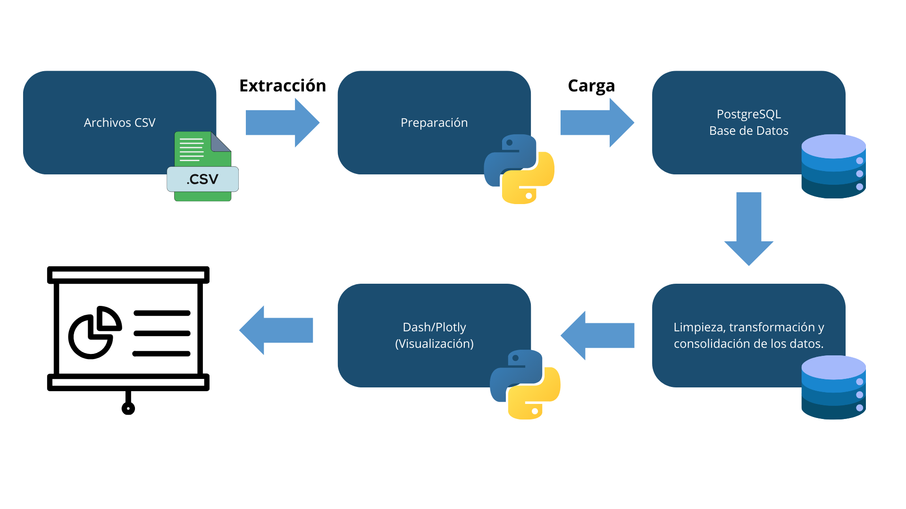

# Sistema Analítico para la Gerencia de Inversiones

Este repositorio contiene el proyecto desarrollado para la prueba técnica de TalentoB 2024-2.

## Pipeline de Datos

## Estructura del Proyecto

- `scripts/`: Contiene los scripts de Python y SQL.
- `README.md`: Instrucciones para reproducir el proyecto.
- `video_demostracion.mp4`: Video demostrativo de la funcionalidad del sistema analítico.

## Requisitos

- PostgreSQL
- Python 3.12
- Librerías de Python: pandas, SQLAlchemy, plotly, dash

## Instrucciones

1. **Instalar PostgreSQL** y crear la base de datos `inversiones`.
2. **Ejecutar los scripts SQL** en `scripts/creación.sql` para crear las tablas necesarias.
3. **Poblar las tablas** ejecutando el script `scripts/cargar_datos.py`.
4. **Ejecutar el script de limpieza** `scripts/limpieza.sql` para limpiar los datos y crear las vistas necesarias.
5. **Ejecutar el script de visualización** `scripts/visualizacion.py` para generar las visualizaciones requeridas.

## Video de Demostración

[Ver video en YouTube](https://www.youtube.com/watch?v=example)

## Conclusiones tecnicas

- Se integraron herramientas como Python y SQL de manera eficiente, aprovechando las fortalezas de cada una: Python para la limpieza y visualización de datos, y SQL para la gestión de la base de datos y la creación de tablas y vistas. Además, se emplearon librerías como Plotly y Dash para generar visualizaciones interactivas, mejorando así la experiencia del usuario y facilitando la interpretación de los resultados.

## Conclusiones de Negocio

- El sistema analítico desarrollado permite a la gerencia de inversiones de la empresa tomar decisiones informadas y basadas en datos, lo que puede contribuir a mejorar la rentabilidad de las inversiones y a reducir los riesgos asociados a las mismas. Además, al contar con visualizaciones interactivas, se facilita la identificación de patrones y tendencias en los datos, lo que puede ayudar a identificar oportunidades de inversión y a optimizar la gestión de cartera.

- 

## Areas de Mejora

- Automatizar la actualización de los datos.
- Mejorar la visualización de los datos.
- Agregar más funcionalidades al sistema analítico.

